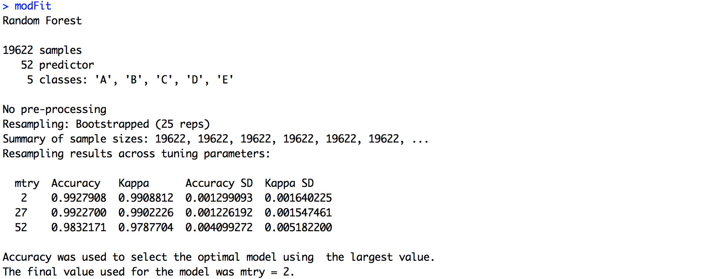
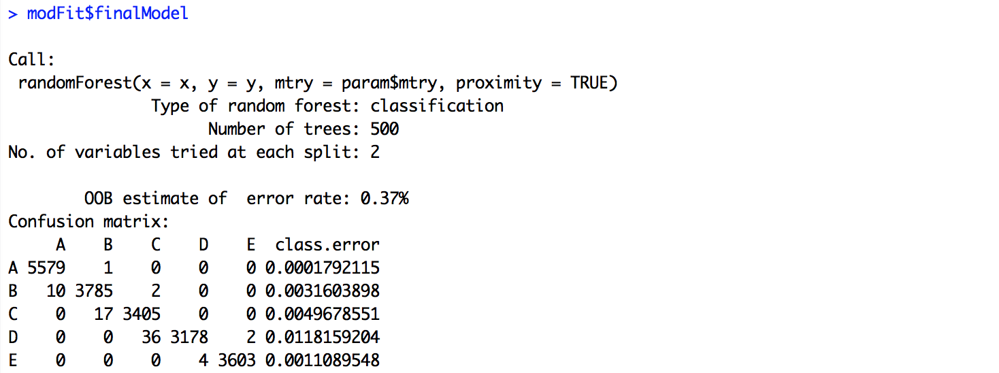
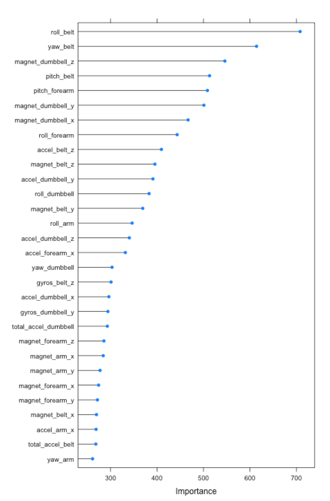

### Synopsis

Using devices such as Jawbone Up, Nike FuelBand, and Fitbit it is possible to collect a large amount of data about personal activity relatively inexpensively. These type of devices are part of the quantified self movement – a group of enthusiasts who take measurements about themselves regularly to improve their health, to find patterns in their behavior, or because they are tech geeks. This project is to quantify how well people do weight lifting exercise according to 5 different ways: exactly according to the specification (Class A), throwing the elbows to the front (Class B), lifting the dumbbell only halfway (Class C), lowering the dumbbell only halfway (Class D) and throwing the hips to the front (Class E).

### Data Processing
The data for this project come from the following resource

Velloso, E.; Bulling, A.; Gellersen, H.; Ugulino, W.; Fuks, H. Qualitative Activity Recognition of Weight Lifting Exercises. Proceedings of 4th International Conference in Cooperation with SIGCHI (Augmented Human '13) . Stuttgart, Germany: ACM SIGCHI, 2013.

The data were collected from accelerometers on the belt, forearm, arm and dumbbell of 6 participants.  They were asked to perform barbell lifts correctly and incorrectly in 5 different ways. The goal is to predict the manner in which they did the exercise.

```{r, include = FALSE}
knitr::opts_chunk$set(eval = TRUE, cache = TRUE)
```

```{r}
pmltrain<-read.csv("pml-training.csv")
pmltest<-read.csv("pml-testing.csv")
```

The dimensions of the above data sets:
```{r}
dim(pmltrain)
dim(pmltest)
```

Per the source of the data, both data sets contain both raw readings of the accelerometers and calculated values using sliding window approach. Out of the total 19622 samples, 406 samples include those calculated values.  With 160 columns of the training data, there are 52 columns of raw readings of the accelerometers, 100 columns of calculated values. Since the test data set does not contain calculated values, I choose to use only the raw readings as potential features to build a model.  The columns of "X","user_name","raw_timestamp_part_1","raw_timestamp_part_2","cvtd_timestamp","new_window" and "num_window" are also omitted since they are irreverent to the model.

```{r}
training<-pmltrain[,grepl("^roll|^pitch|^yaw|^total_accel|_x$|_y$|_z$|^classe$",names(pmltrain))]
testing<-pmltest[,grepl("^roll|^pitch|^yaw|^total_accel|_x$|_y$|_z$|^problem_id$",names(pmltest))]
library(caret)
```

Here are graphics to explore data.

```{r}
g1 <- ggplot(training, aes(x = magnet_dumbbell_z, y = magnet_dumbbell_y)) + geom_point(aes(color=classe)) + facet_wrap(~classe) + scale_y_continuous(limits=c(-1000,1000))
g1 <- g1 + labs(title="magnet_dumbbell_z vs. magnet_dumbbell_y")
g1
g2 <- ggplot(training, aes(x = roll_belt, y = yaw_belt)) + geom_point(aes(color=classe)) + facet_wrap(~classe) 
g2 <- g2 + labs(title="roll_belt vs. yaw_belt")
g2
```

### Results

1. To train with Random Forest

In random forests, there is no need for cross-validation or a separate test set to get an unbiased estimate of the test set error. It is estimated internally, during the run.  Therefore, the entire train data set is used for the training.

```{r,eval=FALSE}
set.seed(2015)
modFit<-train(classe~.,data=training,method="rf",prox=TRUE)
```

Due to the long running time of this line on the computer available, I copy the results from R Studio Console.



```{r,,eval=FALSE}
modFit$finalModel
```



2. OOB Error

To use Out-of-Bag(OOB) as the expected out of sample error.  Per the model from the training, the value is 0.37%.  

3. Variable Importance

```{r,,eval=FALSE}
 plot(varImp(modFit,scale=FALSE),top=30)
```



4.  Predicting the testing data set

Using the model identified, I am able to correctly predict the testing data set.